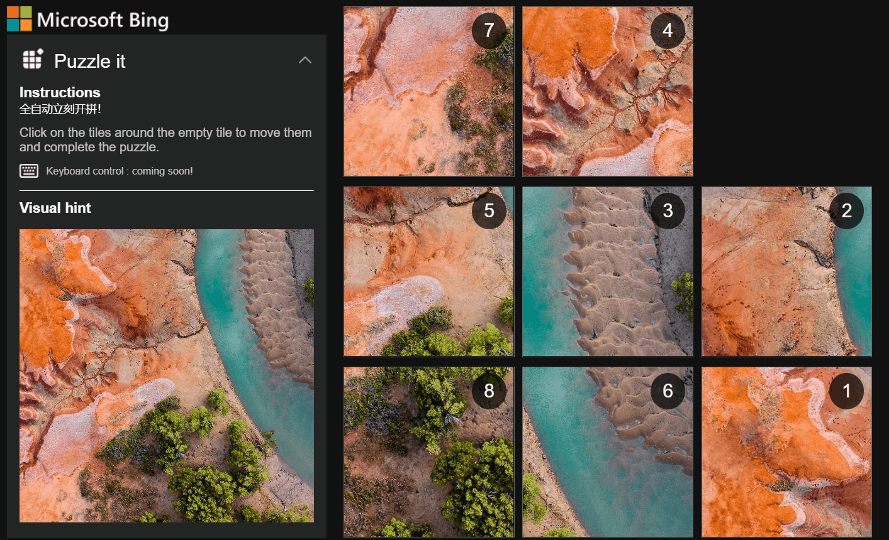

# Bing Puzzle Auto Solver with Advanced Options



## Quick Start Guide

1. **Install the Script**: Add this script to your UserScript manager (Tampermonkey or Greasemonkey).
2. **Open the Puzzle Page**: Navigate to [Bing Image Puzzle](https://www.bing.com/spotlight/imagepuzzle).
3. **Have Fun**: Enjoy automatic puzzle solving with customizable options!

## Overview

This UserScript enhances the Bing Puzzle experience by automating the solving process with advanced options. It supports different algorithms, heuristics, and provides a user-friendly interface for customization.

## Features

- **Automatic Puzzle Solving**: Automatically solves Bing puzzles using BFS (Breadth-First Search) or DFS (Depth-First Search) algorithms.
- **Heuristic Options**: Choose between Manhattan Distance and Hamming Distance heuristics.
- **Customizable Speed**: Adjust the solving speed to fit your preferences.
- **Auto-Start**: Option to automatically start solving the puzzle when the page loads.
- **Step-by-Step Execution**: Option to pause and step through the solution manually.
- **User-Friendly Interface**: Floating control window with buttons and sliders for easy customization.

## Installation

To install this script, you need a UserScript manager like Tampermonkey or Greasemonkey. Once installed, add the script to your UserScript manager.

### Requirements

- [jQuery 3.7.1](https://code.jquery.com/jquery-3.7.1.min.js)
- [jQuery UI 1.13.2 - JS](https://code.jquery.com/ui/1.13.2/jquery-ui.min.js)
- [jQuery UI 1.13.2 - CSS](https://code.jquery.com/ui/1.13.2/themes/smoothness/jquery-ui.css)

## Usage

1. **Install the Script**: Add the script to your UserScript manager.
2. **Navigate to the Puzzle Page**: Go to any Bing puzzle page (`https://*.bing.com/spotlight/imagepuzzle*`).
3. **Control Panel**: Use the floating control window to:
   - **Solve Puzzle**: Start solving the puzzle.
   - **Pause/Resume**: Pause or resume the solving process.
   - **Step**: Execute one step of the solution manually.
   - **Speed**: Adjust the solving speed using the slider.
   - **Algorithm**: Choose between BFS and DFS.
   - **Heuristic**: Choose between Manhattan and Hamming distances.
   - **Auto-Start**: Enable or disable auto-start on page load.
4. **Monitor Progress**: Check the moves counter and timer to monitor the solving progress.

## Advanced Options

### Algorithms

- **BFS (Breadth-First Search)**: Explores all possible moves level by level.
- **DFS (Depth-First Search)**: Explores as far as possible along each branch before backtracking.

### Heuristics

- **Manhattan Distance**: The sum of the absolute differences of the current tile positions from the target positions.
- **Hamming Distance**: The number of tiles that are not in their goal positions.

## Customization

The script provides a flexible interface for customization. Adjust the settings in the floating control window according to your preferences.

## Manual Usage

If you prefer to use the script manually, follow these steps to load the required libraries and execute the script directly from the browser console:

1. **Load jQuery and jQuery UI**: Open the browser console (F12 or right-click and select "Inspect", then go to the "Console" tab) and run the following code to load jQuery and jQuery UI:
    ```javascript
    // Load jQuery from the provided URL
    var script = document.createElement('script');
    script.src = 'https://code.jquery.com/jquery-3.7.1.min.js';
    document.head.appendChild(script);

    // Load jQuery UI from the provided URL
    var uiScript = document.createElement('script');
    uiScript.src = 'https://code.jquery.com/ui/1.13.2/jquery-ui.min.js';
    document.head.appendChild(uiScript);

    // Load jQuery UI CSS
    var uiStylesheet = document.createElement('link');
    uiStylesheet.rel = 'stylesheet';
    uiStylesheet.href = 'https://code.jquery.com/ui/1.13.2/themes/smoothness/jquery-ui.css';
    document.head.appendChild(uiStylesheet);
    ```

2. **Paste the Script**: After loading the necessary libraries, copy the entire UserScript code and paste it into the console. Press Enter to execute the script.

## Development

### Functions

- `calculateMatrixChange(matrix1, matrix2)`: Computes the difference between two matrices.
- `findPositiveElements(matrix)`: Finds elements greater than zero in a matrix.
- `printBoard(board)`: Logs the board state and updates the click list.
- `findBlank(board)`: Identifies the blank tile in the puzzle.
- `isValidMove(x, y)`: Checks if a move is valid.
- `createFloatingWindow()`: Creates the control panel window.
- `solvePuzzle(initBoard)`: Initiates the puzzle-solving process.
- `bfsSolve(initBoard)`: Solves the puzzle using BFS.
- `dfsSolve(initBoard)`: Solves the puzzle using DFS.
- `manhattanDistance(board)`: Computes the Manhattan distance.
- `hammingDistance(board)`: Computes the Hamming distance.
- `startSolving()`: Starts the solving process.
- `togglePause()`: Toggles the pause/resume state.
- `stepSolution()`: Executes the next step in the solution.
- `executeSolution()`: Executes the solution steps.
- `executeMove(xy)`: Executes a single move.
- `updateUI()`: Updates the UI with the current state.
- `updateTimer()`: Updates the timer.
- `updateSpeed()`: Updates the solving speed.
- `updateAlgorithm()`: Updates the algorithm.
- `updateHeuristic()`: Updates the heuristic.
- `updateAutoStart()`: Updates the auto-start setting.

### Styles

Custom styles are added to enhance the appearance and usability of the control panel.

## License

This project is licensed under the MIT License.

## Author

**knva (enhanced by Anas Qiblawi)**

---

Enjoy solving Bing puzzles effortlessly with this enhanced UserScript!

